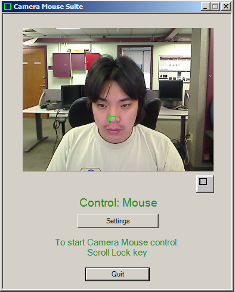
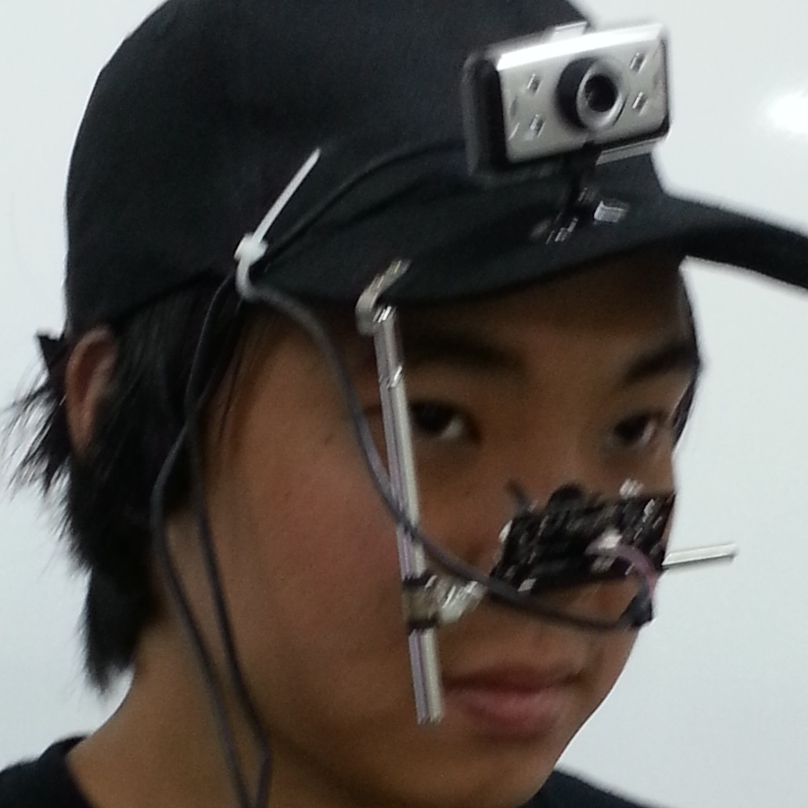
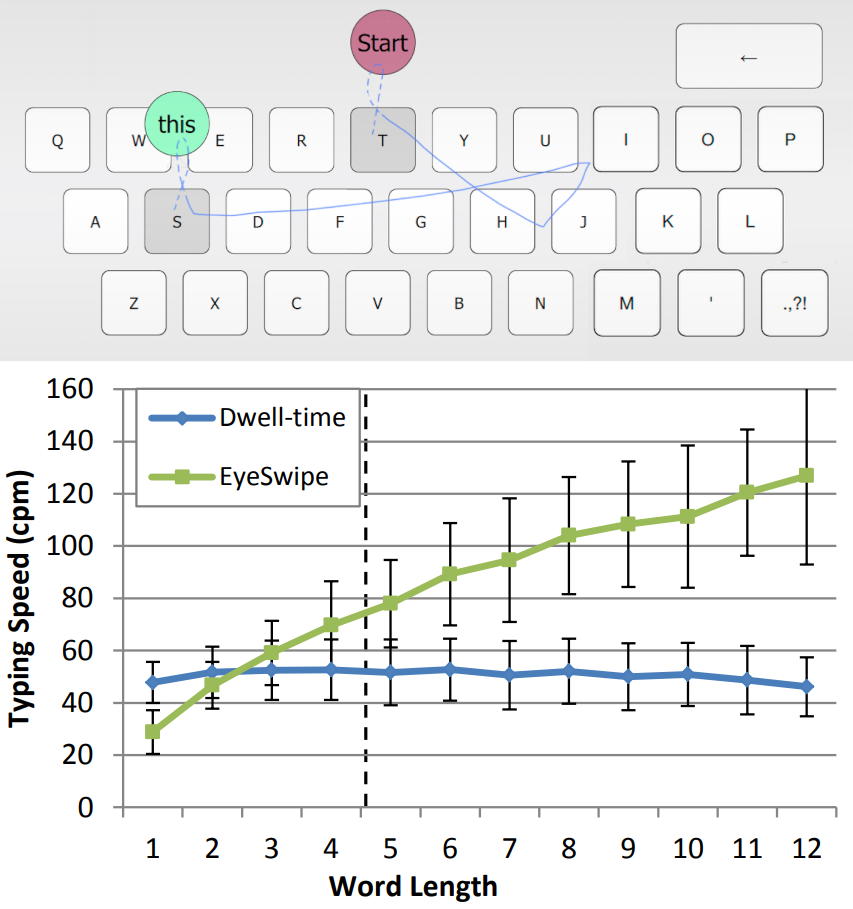
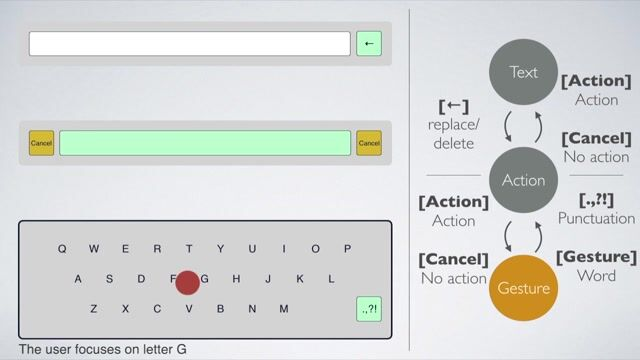
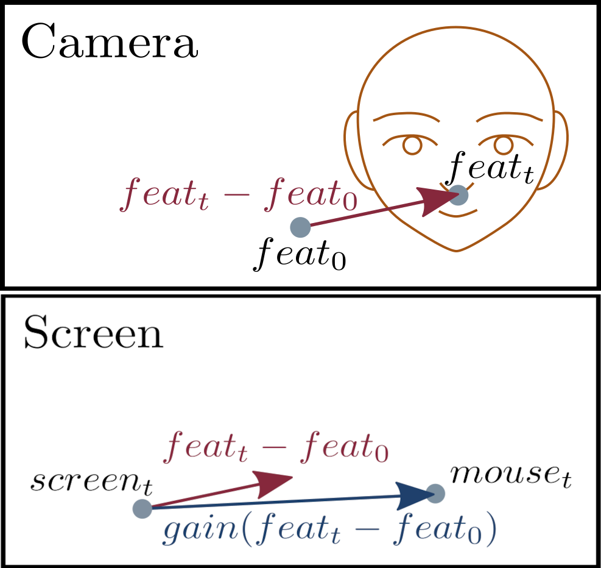
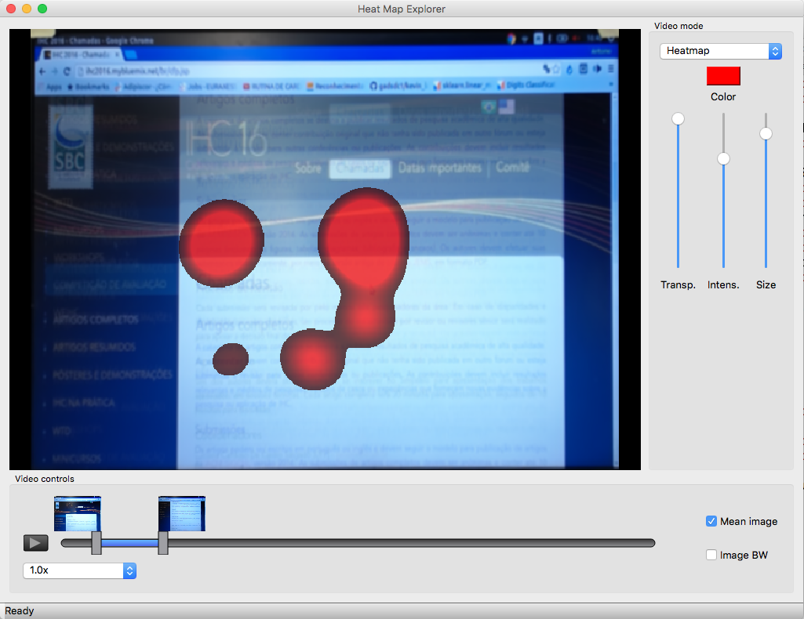

I am an Assistant Professor in Computer Science and Engineering at [Insper](https://www.insper.edu.br/en/). I like to build interactive applications and tools.

## What I've built for research

These are some of my research projects:

### CameraMouseSuite [cross-platform version]  

Qt implementation of Camera Mouse Suite, a mouse-replacement interface that allows users to control the mouse pointer using body movements (e.g. head) captured by a webcam. As the user moves their head (or other body part being tracked by the camera), the mouse pointer replicates their movement. Clicks are performed with dwell time (keeping the mouse pointer still for a certain amount of time).

- **Built with:**   
- **Repo:** https://github.com/toshikurauchi/CameraMouseSuite-cross-platform

 

### Haytham Linux 

Cross-platform mobile gaze tracking software based on [Haytham](http://www.dmardanbegi.com/software.html) by [Diako Mardanbegi](http://www.dmardanbegi.com/). The mobile eye tracker must be built using at least two cameras: one to capture the scene and the other to capture the eye image. Some infrared light must be attached to the eye camera and an infrared filter (an exposed film will do) must also be added.
  
- **Built with:**   
- **Repo:** https://bitbucket.org/toshikurauchi/haytham-linux

 

### EyeSwipe 

Gaze-based text entry method that uses gaze gestures to type words instead of typing letter by letter with dwell-time. The initial and final letters of the word are indicated by performing an eye gesture called "reverse crossing", in which the user looks at a button displayed above the key and then looks back at the key to finish the selection.
  
- **Built with:**  
- **Authors:** Andrew T. N. Kurauchi, Wenxin Feng, Ajjen Joshi, Carlos H. Morimoto, Margrit Betke
- **Repo:** https://github.com/toshikurauchi/eyeswipe
- **Paper:** https://dl.acm.org/doi/10.1145/2858036.2858335
- **Video:** https://www.youtube.com/watch?v=QpghYJwTMuc
- **Talk@CHI'16:** https://www.youtube.com/watch?v=KAoyekbur8I

 

### Swipe&Switch 

An evolution of EyeSwipe that uses context switching between regions as a selection method. There are three regions: Text, Action, and Gesture regions. To type a word, the user looks at the Gesture region, glances at the letters that form the desired word and then moves their gaze to either the Text or Action regions.

- **Built with:**  
- **Authors:** Andrew T. N. Kurauchi, Wenxin Feng, Ajjen Joshi, Carlos H. Morimoto, Margrit Betke
- **Repo:** https://github.com/toshikurauchi/swipe-and-switch
- **Paper:** https://dl.acm.org/doi/10.1145/3379350.3416193

 

### HMAGIC: Head Movement and Gaze Input Cascaded Pointing 

Head Movement And Gaze Input Cascaded (HMAGIC) pointing is a technique that combines head movement and gaze-based inputs in a fast and accurate mouse-replacement interface. The interface initially places the pointer at the estimated gaze position and then the user makes fine adjustments with their head movements. 

- **Built with:**  
- **Authors:** Andrew T. N. Kurauchi, Wenxin Feng, Carlos H. Morimoto, Margrit Betke
- **Repo:** https://github.com/toshikurauchi/CameraMouseSuite/tree/MAGICMouse-Head-Trigger
- **Paper:** https://dl.acm.org/doi/abs/10.1145/2769493.2769550

 

### Heatmap Explorer 

An interactive gaze data visualization tool for the evaluation of computer interfaces. Heatmap Explorer allows the experimenter to control the visualization by selecting temporal intervals and adjusting filter parameters of the eye movement classification algorithm.

- **Built with:**   
- **Authors:** Antonio Diaz Tula, Andrew T. N. Kurauchi, Flávio L. Coutinho, and Carlos H. Morimoto
- **Repo:** https://bitbucket.org/latin/heatmap_explorer/src/master/
- **Paper:** https://dl.acm.org/doi/10.1145/3033701.3033725

## What I've built for teaching

Here's some stuff I've built for the courses I teach:

- **Python Gym:** a web app with which students can learn and practice coding in Python and get instant feedback on their exercises. It is used by all our engineering students in their intro to programming course.
  - **Authors:** several students and faculty from Insper contributed to this project. For a full list, go to https://github.com/Insper/servidor-de-desafios/graphs/contributors
  - [Backend](https://github.com/insper/servidor-de-desafios):
    - Built with:  
  - [Frontend](https://github.com/toshikurauchi/servidor-de-desafios-frontend)
    - Built with:   
- **[Active Handout Astro](https://toshikurauchi.github.io/active-handout-astro/):** a framework for interactive course development built with [Astro](https://astro.build/). Complete rewrite applying lessons learnt from building the [original Active Handout framework](https://github.com/insper-education/active-handout-plugins-py). Instructors can build their course material with multiple choice questions, Parsons problems, text exercises, slides, and more, using MDX.
  - **Repo:** https://github.com/toshikurauchi/active-handout-astro
  - **Built with:**      
- **[Active Handout](https://insper-education.github.io/active-handout/):** a framework for interactive course development built with [MkDocs](https://www.mkdocs.org/). Instructors can build their course material with multiple choice questions, Parsons problems, text exercises, slides, and more, using markdown.
  - **Authors:** [Andrew Kurauchi](https://github.com/toshikurauchi), [Igor Montagner](https://github.com/igordsm), [Rafael Corsi](https://github.com/rafaelcorsi), [Leonardo Mendes](https://github.com/zMendes), [Marcio Stabile](https://github.com/mfstabile), [Graziela Tonin](https://github.com/gttonin), [Bárbara Agena](https://github.com/BarbaraTieko)
  - **Repo:** https://github.com/insper-education/active-handout-plugins-py
  - **Built with:**     
- I've also developed some course material using the above tools. They are in private repos because they may contain sensitive information, such as exam questions, but I will gladly share them with other interested instructors.