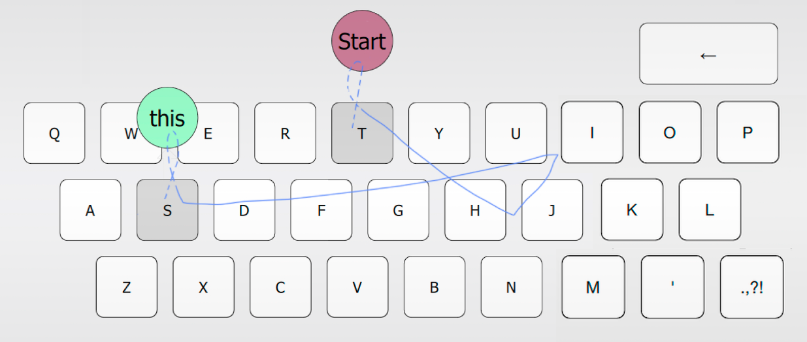

I am an Assistant Professor in Computer Science and Engineering at [Insper](https://www.insper.edu.br/en/). I like to build interactive applications and tools.

## What I've built for research

These are some of my research projects:

### CameraMouseSuite [cross-platform version]

 

Qt implementation of Camera Mouse Suite, a mouse-replacement interface that allows users to control the mouse pointer using body movements (e.g. head) captured by a webcam.

- **Built with:**   
- **Repo:** https://github.com/toshikurauchi/CameraMouseSuite-cross-platform

### Haytham Linux

Cross-platform mobile gaze tracking software based on [Haytham](http://www.dmardanbegi.com/software.html) by [Diako Mardanbegi](http://www.dmardanbegi.com/)
  
- **Built with:**   
- **Repo:** https://bitbucket.org/toshikurauchi/haytham-linux

### EyeSwipe

Gaze-based text entry method that uses gaze gestures to type words instead of typing letter by letter with dwell-time.
  
- **Built with:**  
- **Repo:** https://github.com/toshikurauchi/eyeswipe
- **Paper:** https://dl.acm.org/doi/10.1145/2858036.2858335
- **Video:** https://www.youtube.com/watch?v=QpghYJwTMuc
- **Talk@CHI'16:** https://www.youtube.com/watch?v=KAoyekbur8I

## What I've built for teaching

Here's some stuff I've built (some in collaboration with my colleagues) for the courses I teach:

- **Python Gym:** a web app with which students can learn and practice coding in Python and get instant feedback on their exercises. It is used by all our engineering students in their intro to programming course.
  - [Backend](https://github.com/insper/servidor-de-desafios):
    - Built with:  
  - [Frontend](https://github.com/toshikurauchi/servidor-de-desafios-frontend)
    - Built with:   
- **[Active Handout Astro](https://toshikurauchi.github.io/active-handout-astro/reference/):** a framework for interactive course development. Instructors can build their course material with multiple choice questions, Parsons problems, text exercises, slides, and more, using MDX.
  - Repo: https://github.com/toshikurauchi/active-handout-astro
  - Built with:      

